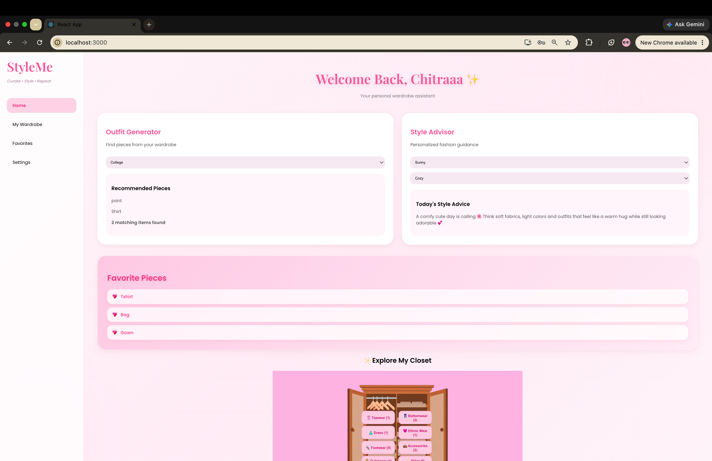
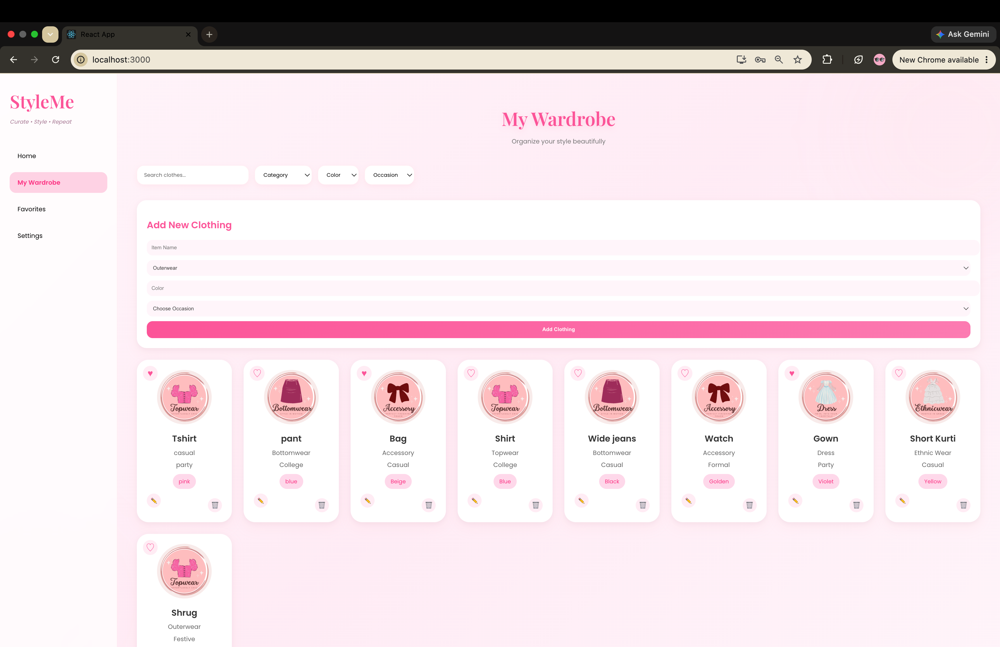
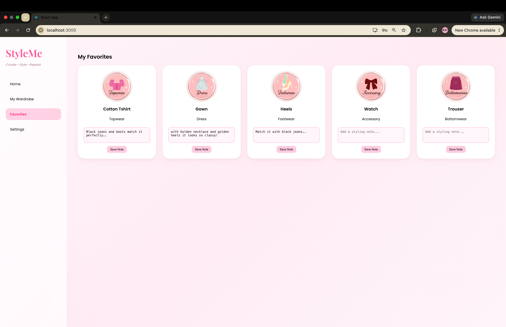
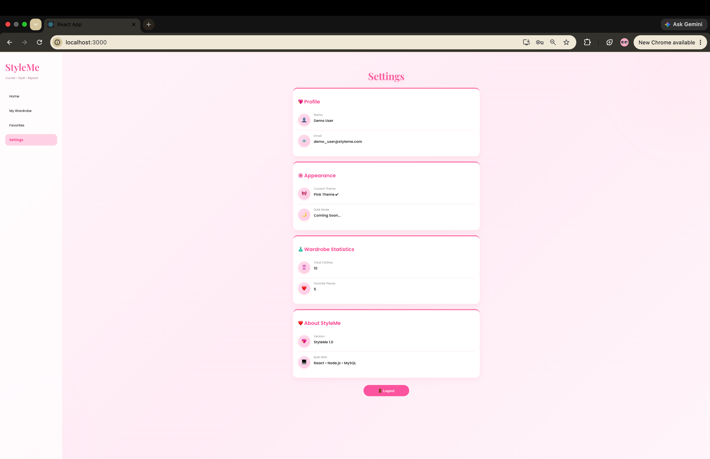
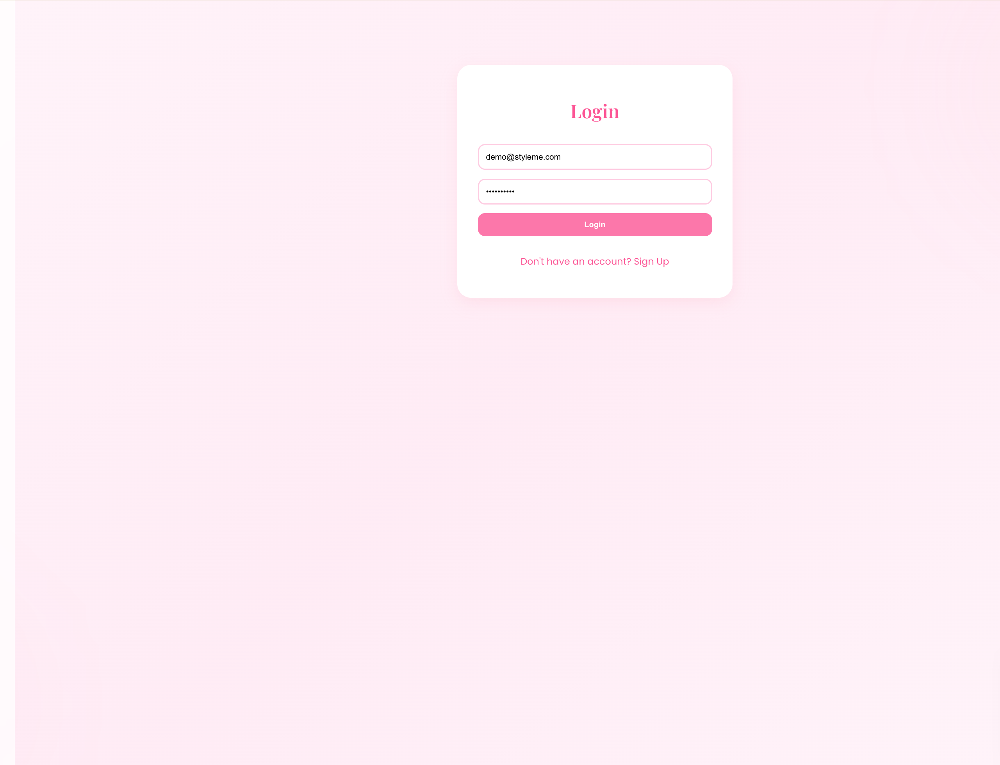
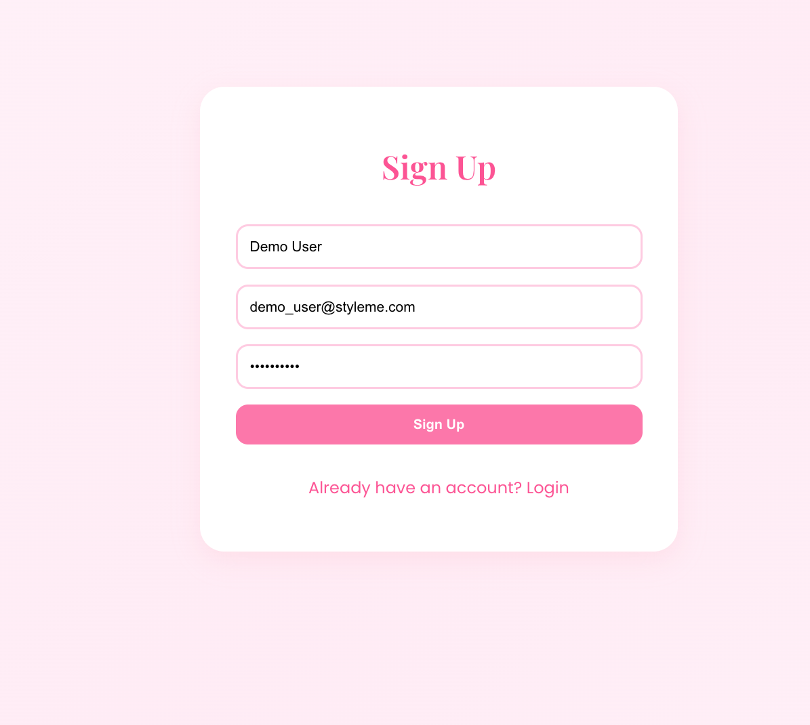

# StyleMe 👗

### Digital Wardrobe Planner

A full-stack wardrobe management web application that helps users organize their clothing, manage favorites, add personal styling notes, and discover outfit ideas based on weather and mood.

Built with **React.js**, **Node.js**, **Express.js**, and **MySQL**, StyleMe provides each user with a secure, personalized digital wardrobe through authentication and user-specific data management.

---

## ✨ Overview

Keeping track of clothes and planning outfits can be difficult, especially with a growing wardrobe. StyleMe simplifies wardrobe management by allowing users to store clothing items digitally, categorize them, search and filter their collection, mark favorite pieces, and keep styling notes for future reference.
The application also includes a dashboard, style advisor, and personalized settings to provide a modern and user-friendly experience.

---

## ✨ Features

* User authentication (Sign Up & Login)
* Personalized wardrobe for each user
* Add, edit, and delete clothing items
* Search and filter clothes
* Mark favorite clothing items
* Add styling notes
* Dashboard with wardrobe statistics
* Style Advisor based on weather and mood
* Dynamic profile and settings page

---

## 🛠 Tech Stack

**Frontend**
- React.js
- CSS

**Backend**
- Node.js
- Express.js

**Database**
- MySQL

**Authentication**
- JWT
- bcryptjs

**Tools**
- Git
- GitHub
- Visual Studio Code

---

## 📁 Project Structure

```text
StyleMe/
│
├── backend/
│   ├── auth/
│   ├── config/
│   ├── controllers/
│   ├── middleware/
│   ├── models/
│   ├── routes/
│   ├── .env
│   ├── server.js
│   └── package.json
│
├── frontend/
│   ├── public/
│   ├── src/
│   └── package.json
│
└── README.md
```

---

## 📸 Screenshots

### Dashboard



### My Wardrobe



### Favorites



### Settings



### Login



### Sign Up



---

## 🚀 Future Enhancements

* AI-powered outfit recommendations
* Clothing image upload support
* Outfit planning calendar
* Wardrobe analytics and insights
* Personalized fashion trend recommendations

---

## 👩‍💻 Author

**Nida Kamil**

B.Tech Information Technology Student
Pimpri Chinchwad College of Engineering (PCCOE), Akurdi
